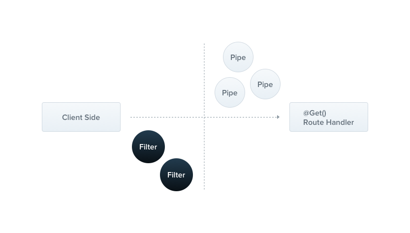

---
presentation:
  width: 1500
  height: 900
  theme: blood.css
---

<!-- slide -->

## Postgres SQL

- PostgresSQL: uma opção de banco de dados robusta e gratuita para projetos pessoais e corporativos, sem necessidade de licença paga.

- Ele é um banco de dados com extensibilidade então podemos permitindo a criação de novos tipos de dados, operadores, funções.

- Além das operações SQL padrão, o PostgreSQL suporta várias extensões do padrão SQL, como janelas de funções analíticas, agregações personalizadas, e outros recursos avançados.

- O PostgreSQL oferece suporte a gatilhos (triggers) e procedimentos armazenados, que permitem automatizar a execução de ações quando eventos específicos ocorrem no banco de dados.

- É projetado para suportar transações simultâneas de forma eficiente, garantindo a integridade dos dados com o modelo ACID.

- Oferece recursos avançados de replicação para suportar ambientes distribuídos e tolerantes a falhas.

- Oferece uma variedade de tipos de índices para otimizar o desempenho de consultas.

<!-- slide -->

## API (Application Programming Interface)

- É uma interface que permite a comunicação entre sistemas , facilitando a integração e o desenvolvimento de aplicativos, podemos ser consumidores de um API ou fornecedores de uma API

<!-- slide -->

## APIS

- Interface de programação para interação entre sistemas.
    - Exemplo: API de pagamento

- Abstração de funcionalidades para simplificar o uso.
    - Exemplo: API de banco de dados

- Facilitar a integração de componentes da aplicação.
    - Exemplo: API Redes Sociais
- Conjunto de métodos e operações para realizar tarefas.
    - Exemplo: Uma API de processamento de imagem
- Comunicação por meio de protocolos estabelecidos.
    - Exemplo: API RESTful que usa o protocolo HTTP / GRPC HTTP2
- Estimula o ecossistema dev.
    - Exemplo: API Google maps para construção de apps de GPS
- Apis nos ajudam a não reinventar a roda.

<!-- slide -->

## API REST / RESTFUL

- REST é um estilo arquitetural que facilita a comunicação entre sistemas, utilizando protocolos estabelecidos e promovendo a integração de componentes da aplicação sem reinventar a roda.

- Baseado nos princípios da web e do protocolo HTTP.

<!-- slide -->

## Protocolo HTTP

- HTTP é um protocolo de comunicação que permite a transferência de dados entre cliente e servidor na web.

- Utilizado para operações CRUD em recursos.

- Métodos HTTP (GET, POST, PUT, DELETE) interagem com os recursos.

<!-- slide -->

## URLS

- Identificam os recursos por meio de URLs.
- URLs representam os endpoints da API.

- GET /usuarios: Retorna uma lista de todos os usuários.

- GET /usuarios/123: Retorna o usuário com o ID 123.

- POST /usuarios: Cria um novo usuário.

- PUT /usuarios/123: Atualiza o usuário com o ID 123.

- DELETE /usuarios/123: Exclui o usuário com o ID 123.

<!-- slide -->

## Comunicação Cliente/Servidor

- Cliente envia solicitações HTTP para o servidor.

- Servidor processa a solicitação e envia resposta HTTP.

- Solicitações HTTP são stateless, sem memória de estado do cliente.

- Retorno em diferentes formatos (JSON, XML).

<!-- slide -->

## Start da aplicação

```typescript 
npm init -y
```

```typescript 
npm i -D @types/node tsup tsx typescript fastify
```

```typescript 
npm i fastify 
```

- @types/node biblioteca com os tipos do NodeJS

- tsup biblioteca para fazer o transpiler o nosso código com zero configurações

- tsx biblioteca para executar nosso código typescript com zero configuração

- typescript 

- fastify e um web framework rápido e simples - foi desenvolvido inspirado no express e no Hapi

<!-- slide -->

## Zod && DOTENV

- ZOD biblioteca para validação de schema

```typescript
import { z } from 'zod';

// Definindo o esquema
const UserSchema = z.object({
  nome: z.string(),
  email: z.string().email(),
  idade: z.number().min(0),
});

// Dados a serem validados
const dados = {
  nome: "João",
  email: "joao@example.com",
  idade: 25,
};

// Validando os dados
const resultado = UserSchema.safeParse(dados);

if (resultado.success) {
  console.log("Dados válidos!");
} else {
  console.log("Dados inválidos:", resultado.error);
}
```

- DOTENV é uma biblioteca para adicionarmos variáveis de ambiente no processo do NODEJS

<!-- slide -->

## ESLINT

- ESLint é uma ferramenta de análise de código estática para identificar padrões problemáticos encontrados no código JavaScript.

<!-- slide -->

## Script DB

```sql 
CREATE TABLE product (
id UUID PRIMARY KEY,
name VARCHAR(255) NOT NULL,
description TEXT,
image_url VARCHAR(255),
price DOUBLE PRECISION
);

CREATE TABLE category (
id SERIAL PRIMARY KEY,
name VARCHAR(255) NOT NULL,
creation_date TIMESTAMP WITHOUT TIME ZONE
);

CREATE TABLE product_category (
product_id UUID NOT NULL,
category_id SERIAL NOT NULL,
PRIMARY KEY (product_id, category_id),
FOREIGN KEY (product_id) REFERENCES product (id) ON DELETE CASCADE,
FOREIGN KEY (category_id) REFERENCES category (id) ON DELETE CASCADE
);

CREATE TABLE address (
    id SERIAL PRIMARY KEY,
    street VARCHAR(255) NOT NULL,
    city VARCHAR(255) NOT NULL,
    state VARCHAR(2) NOT NULL,
    zip_code VARCHAR(10) NOT NULL
);

CREATE TABLE person (
id BIGSERIAL PRIMARY KEY,
cpf VARCHAR(11) not null,
name VARCHAR(100) not null,
birth DATE not null,
email varchar(255) not null
);

alter table address 
add column person_id bigint not null;

alter table address 
add constraint fk_address_person
foreign key (person_id)
references person(id);

CREATE TABLE user (
    id SERIAL PRIMARY KEY,
    username VARCHAR(255) NOT NULL,
    password VARCHAR(255) NOT NULL
);

alter table person 
add column user_id int unique,
add constraint fk_user_id foreign key (user_id) references user(id);
```
-

<!-- slide -->

## Repository Pattern

- O Repository Pattern é um padrão de design que abstrai a lógica de acesso a dados de um aplicativo, permitindo que ele interaja com diferentes tipos de bancos de dados sem alterar a lógica de negócios. Ele cria uma camada intermediária entre a lógica de negócios e o acesso a dados, tornando o código mais organizado, reutilizável e fácil de manter.


<!-- slide -->  

## Use cases

- Um Caso de Uso é uma representação completa de todas as potenciais ações que um usuário pode realizar em um sistema. Cada ação é considerada uma requisição, e o Caso de Uso especifica como o sistema responde a essa requisição.

<!-- slide -->  

## SOLID

- SOLID é um conjunto de cinco princípios de design orientado a objetos que ajudam a produzir software que é fácil de manter, de entender e de expandir ao longo do tempo.

<!-- slide -->  

## Single Responsibility Principle (Princípio da Responsabilidade Única)

- Uma classe deve ter apenas um motivo para mudar.

<!-- slide -->  

## Dependency Inversion Principle (Princípio da Inversão de Dependência)

- Dependa de abstrações, não de concreções.

<!-- slide -->  

## Controller

- Em uma Web API, um Controller é uma classe que lida com as solicitações HTTP do cliente, processa a lógica de negócios necessária e retorna uma resposta HTTP.

<!-- slide -->  

## Driver DB

- Um driver de banco de dados é um software que permite a uma aplicação interagir com um banco de dados, facilitando operações como conexão, consulta, atualização e manipulação de dados.

<!-- slide -->  

## ORM

- ORM (Object-Relational Mapping) é uma técnica de programação que converte dados entre sistemas incompatíveis usando programação orientada a objetos, permitindo que os desenvolvedores interajam com o banco de dados usando objetos em vez de SQL.

<!-- slide -->  

## Factory Pattern

- O Factory Pattern é um padrão de design que usa métodos de fábrica para lidar com a criação de objetos, permitindo que uma classe delegue a instânciação de objetos para subclasses.

<!-- slide -->  

## Interface 

- Em TypeScript, uma interface é uma estrutura que define o contrato para classes, definindo quais métodos e propriedades uma classe deve implementar.

<!-- slide -->  

## TypeORM

- TypeORM é uma biblioteca ORM para TypeScript e JavaScript que permite interagir com bancos de dados usando objetos e classes em vez de SQL diretamente.

<!-- slide --> 

## Migrations

- Migrations são uma maneira de gerenciar alterações e evoluções do esquema de um banco de dados ao longo do tempo, permitindo que você versione e controle as alterações de forma sistemática e organizada.

<!-- slide --> 

## Middlewares

- Middleware em uma API web é uma função ou um conjunto de funções que são executadas antes da rota final do pedido, usadas para manipular o pedido e a resposta, ou para executar tarefas específicas como autenticação, logging, etc.

<!-- slide --> 

## JWT

- JWT (JSON Web Token) é um padrão para autenticação de usuários em uma API, onde um token compacto e autocontido é gerado durante o login (sign-in), contendo um payload com informações do usuário, que pode ser verificado e confiável porque é assinado digitalmente.

<!-- slide --> 

## MongoDB

- O MongoDB é um banco de dados orientados a documentos ele traz uma abordagem flexível e escalável e ele não vai salvar os dados da maneira tradicional como um banco SQL ele vai salvar objetos BJSON(Bynary JSON) a estrutura e a mesma do JSON que ja conhecemos.  

<!-- slide --> 

## Controllers (NestJS)


<!-- slide --> 

## Providers (NestJS)


<!-- slide --> 

## Módulos (NestJS)


<!-- slide --> 

## Midlewares (NestJS)


<!-- slide --> 

## Exception filters (NestJS)




<!-- slide --> 

## Pipes (NestJS)


<!-- slide --> 

## Guards (NestJS)


<!-- slide --> 

## Interceptors (NestJS)


<!-- slide --> 

## Sequência do Ciclo de Vida (NestJS)


